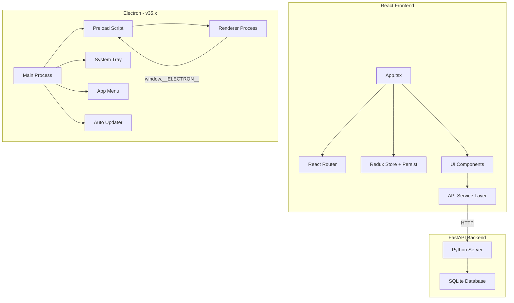
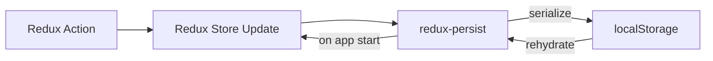

# SmileX Dict - 平台分析与升级计划

## 一、现有问题分析

### 1. 严重 Bug

| # | 问题 | 文件 | 行号 | 说明 |
|---|------|------|------|------|
| 1 | **Slice name 拼写错误** | `src/features/words/wordsSlice.ts` | 37 | `namze: 'words'` 应为 `name: 'words'`，这会导致 Redux DevTools 显示异常，但不影响功能 |
| 2 | **路由缺失** | `src/routes/Home.tsx` | 36-38 | 链接到 `/collections`、`/wrong-words`、`/mastered`，但 `App.tsx` 中未定义这些路由，点击后显示空白页 |
| 3 | **Electron 依赖缺失** | `package.json` | - | `electron` 和 `electron-builder` 未在 dependencies/devDependencies 中声明，`electron:dev` 和 `electron:build` 脚本无法执行 |
| 4 | **空队列无保护** | `src/routes/PracticeWords.tsx` | 25 | 当 `queue` 为空时 `current` 为 `undefined`，页面会崩溃 |
| 5 | **空文章队列无保护** | `src/routes/PracticeArticles.tsx` | 28 | 同上，`current` 可能为 `undefined` |

### 2. 功能缺失

| # | 缺失功能 | 优先级 | 说明 |
|---|----------|--------|------|
| 1 | **数据持久化** | 🔴 高 | Redux 状态仅存内存，刷新页面后所有学习进度丢失 |
| 2 | **API 服务层** | 🔴 高 | `fetch` 调用散落在各组件中，无统一错误处理 |
| 3 | **收藏/错词/已掌握页面** | 🔴 高 | Home 页有链接但无对应路由和页面 |
| 4 | **错误处理 UI** | 🟡 中 | API 调用 `.catch(()=>{})` 静默吞掉错误，用户无感知 |
| 5 | **加载状态** | 🟡 中 | 数据加载时无 loading 指示器 |
| 6 | **移动端导航** | 🟡 中 | 顶部导航在小屏幕上溢出，无汉堡菜单 |
| 7 | **暗黑模式** | 🟢 低 | 无深色主题支持 |
| 8 | **设置页面** | 🟢 低 | 无 API 地址配置、学习目标设置等 |
| 9 | **发音功能** | 🟢 低 | 单词练习无语音播放 |
| 10 | **搜索功能** | 🟢 低 | 词典/单词无搜索 |
| 11 | **数据导入导出** | 🟢 低 | 无法备份/恢复学习数据 |

### 3. UI/UX 问题

| # | 问题 | 说明 |
|---|------|------|
| 1 | **响应式不足** | 导航栏在移动端不适配，无折叠菜单 |
| 2 | **无过渡动画** | 页面切换、弹窗出现无动画效果 |
| 3 | **弹窗交互不完整** | Dicts.tsx 中的模态框点击背景无法关闭 |
| 4 | **无空状态设计** | 列表为空时仅显示文字，缺少引导插图 |
| 5 | **PWA manifest 不完整** | `icons` 数组为空，无法安装为 PWA |
| 6 | **无 Footer** | 页面底部无版权/链接信息 |

### 4. Electron 问题

| # | 问题 | 说明 |
|---|------|------|
| 1 | **依赖未安装** | `electron` 和 `electron-builder` 未在 package.json 中 |
| 2 | **版本过旧/未指定** | 无版本锁定 |
| 3 | **无 preload 脚本** | 缺少 contextBridge 安全通信 |
| 4 | **无窗口菜单** | 缺少应用菜单 |
| 5 | **无窗口状态持久化** | 窗口位置/大小不记忆 |
| 6 | **无自动更新** | 缺少 electron-updater |
| 7 | **无系统托盘** | 缺少最小化到托盘功能 |
| 8 | **无打包配置** | electron-builder 配置缺失 |

---

## 二、升级计划

### 阶段 1：修复关键 Bug

1. **修复 `wordsSlice.ts` 拼写错误**：`namze` → `name`
2. **添加缺失路由**：在 `App.tsx` 中添加 `/collections`、`/wrong-words`、`/mastered` 路由，创建对应页面组件
3. **空队列保护**：`PracticeWords.tsx` 和 `PracticeArticles.tsx` 添加空状态提示

### 阶段 2：Electron 升级到最新版

当前 Electron 最新稳定版为 **v35.x**（2026年4月）。升级内容：

1. **安装依赖**：
   - `electron@^35.0.0`（devDependency）
   - `electron-builder@^26.0.0`（devDependency）

2. **重构 `electron/main.js`**：
   - 迁移为 ESM 或保持 CJS 兼容
   - 添加 `preload.js` 脚本（contextBridge 安全通信）
   - 添加应用菜单（Menu template）
   - 窗口状态持久化（位置、大小）
   - 添加系统托盘支持
   - 添加 `electron-builder` 打包配置（package.json build 字段）

3. **Electron Builder 配置**：
   ```
   appId: com.smilex.dict
   productName: SmileX Dict
   directories.output: release
   files: [dist/**/*, electron/**/*]
   win: NSIS installer
   mac: dmg
   linux: AppImage
   ```

### 阶段 3：数据持久化

1. **Redux Persist**：集成 `redux-persist` 库
   - 自动将 Redux state 同步到 `localStorage`
   - 配置 whitelist（words、dicts、panel、articles）
   - 在 `store/index.ts` 中配置 persistor

### 阶段 4：API 服务层与错误处理

1. **创建 `src/services/api.ts`**：
   - 统一封装 fetch 请求
   - 基础 URL 从 config 读取
   - 统一错误处理和重试逻辑
   - 请求/响应拦截

2. **创建 `src/hooks/useApi.ts`**：
   - 封装 loading/error 状态
   - 统一的异步请求 hook

3. **添加全局错误边界**：
   - React Error Boundary 组件
   - 友好的错误提示页面

### 阶段 5：UI/UX 优化

1. **响应式导航**：
   - 移动端汉堡菜单
   - 底部导航栏（移动端）
   - 桌面端顶部导航保持不变

2. **暗黑模式**：
   - Tailwind `darkMode: 'class'` 配置
   - CSS 变量主题切换
   - 跟随系统偏好 + 手动切换

3. **过渡动画**：
   - 页面路由切换动画（framer-motion 或 CSS transitions）
   - 弹窗出现/消失动画
   - 列表项加载动画

4. **交互优化**：
   - 模态框支持点击背景关闭
   - 空状态插图和引导
   - 加载骨架屏
   - Toast 通知组件

5. **PWA 完善**：
   - 生成 PWA icons（192x192, 512x512）
   - 完善 manifest 配置

### 阶段 6：新功能页面

1. **收藏/错词/已掌握页面**：
   - 复用单词列表组件
   - 支持批量操作

2. **设置页面**：
   - API 地址配置
   - 每日学习目标
   - 主题切换
   - 数据导入/导出

---

## 三、架构优化图



## 四、数据持久化流程



## 五、文件变更预估

### 新增文件
| 文件路径 | 说明 |
|----------|------|
| `electron/preload.js` | Electron preload 安全桥接 |
| `electron/menu.js` | 应用菜单配置 |
| `electron/tray.js` | 系统托盘配置 |
| `src/services/api.ts` | API 请求封装 |
| `src/hooks/useApi.ts` | 异步请求 hook |
| `src/hooks/useTheme.ts` | 主题切换 hook |
| `src/components/ErrorBoundary.tsx` | 错误边界 |
| `src/components/Toast.tsx` | Toast 通知 |
| `src/components/Loading.tsx` | 加载组件 |
| `src/components/EmptyState.tsx` | 空状态组件 |
| `src/components/MobileNav.tsx` | 移动端导航 |
| `src/routes/Collections.tsx` | 收藏页面 |
| `src/routes/WrongWords.tsx` | 错词本页面 |
| `src/routes/Mastered.tsx` | 已掌握页面 |
| `src/routes/Settings.tsx` | 设置页面 |

### 修改文件
| 文件路径 | 变更内容 |
|----------|----------|
| `package.json` | 添加 electron、electron-builder、redux-persist 等依赖 |
| `electron/main.js` | 重构为完整 Electron 主进程 |
| `src/App.tsx` | 添加新路由、移动端导航、主题切换 |
| `src/main.tsx` | 集成 Redux Persist |
| `src/store/index.ts` | 配置 redux-persist |
| `src/index.css` | 添加暗黑模式样式、动画 |
| `src/features/words/wordsSlice.ts` | 修复 `namze` 拼写错误 |
| `src/routes/Home.tsx` | 修复链接指向 |
| `src/routes/Dicts.tsx` | 模态框交互优化 |
| `src/routes/PracticeWords.tsx` | 空状态保护 |
| `src/routes/PracticeArticles.tsx` | 空状态保护 |
| `src/routes/Panel.tsx` | 使用 API 服务层 |
| `src/routes/Library.tsx` | 使用 API 服务层 |
| `tailwind.config.js` | 添加 darkMode 配置 |
| `vite.config.ts` | 完善 PWA 配置 |

---

## 六、执行优先级

```mermaid
gantt
    title 升级执行顺序
    dateFormat X
    axisFormat %s

    section 阶段1 - Bug修复
    修复拼写错误和缺失路由    :p1, 0, 1
    空队列保护               :p2, 1, 2

    section 阶段2 - Electron升级
    安装最新版Electron        :p3, 2, 3
    重构主进程和preload       :p4, 3, 5
    配置electron-builder     :p5, 5, 6

    section 阶段3 - 数据持久化
    集成redux-persist        :p6, 6, 7

    section 阶段4 - API服务层
    创建API封装和hooks        :p7, 7, 9
    错误边界和Toast组件       :p8, 9, 10

    section 阶段5 - UI优化
    响应式导航               :p9, 10, 11
    暗黑模式                 :p10, 11, 12
    动画和交互优化            :p11, 12, 13
    PWA完善                  :p12, 13, 14

    section 阶段6 - 新功能
    收藏/错词/已掌握页面      :p13, 14, 15
    设置页面                 :p14, 15, 16
```



## 七、Electron 升级详细方案

### 当前状态
- `electron/main.js` 仅有 31 行基础代码
- 无 Electron 依赖声明
- 无 preload、menu、tray、updater

### 升级目标
- Electron v35.x（最新稳定版）
- 完整的主进程架构
- 安全的渲染进程通信
- 专业的打包配置

### electron/main.js 重构要点

```
1. 窗口管理
   - 记忆窗口位置和大小
   - 支持最小宽度/高度限制
   - 窗口关闭时保存状态

2. 菜单
   - 文件：新建窗口、设置
   - 编辑：撤销、重做、剪切、复制、粘贴
   - 视图：重新加载、开发者工具、缩放
   - 窗口：最小化、关闭
   - 帮助：关于

3. 系统托盘
   - 最小化到托盘
   - 托盘右键菜单
   - 点击托盘恢复窗口

4. 安全
   - contextIsolation: true
   - nodeIntegration: false
   - sandbox: true
   - preload.js 通过 contextBridge 暴露有限 API

5. 打包配置
   - Windows: NSIS 安装包
   - macOS: DMG
   - Linux: AppImage
   - 自动更新（electron-updater）
```
