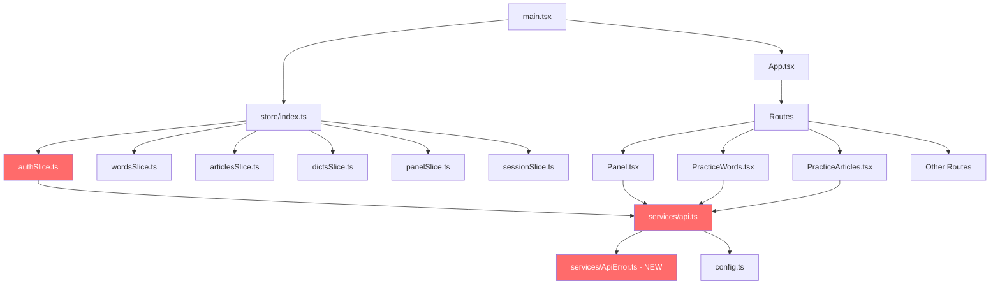

# SmileX-Dict Bug Fix Plan

## Overview

The project has several critical files that are corrupted with duplicated/triplicated content, broken imports, and missing modules. These issues prevent the project from building and running.

---

## Issue 1: `src/services/api.ts` — Severely Corrupted (CRITICAL)

### Problems

1. **Duplicate code**: Lines 99-188 and 189-250 contain identical interface/type/API definitions duplicated
2. **Missing modules**: Imports `ApiError` from `./ApiError` and `request` from `./request` — neither file exists in `src/services/`
3. **Broken `originalRequestWithAuth` function** (lines 52-66):
   - References undefined `options` variable
   - References `originalRequest.config` which doesn't exist on the imported `request`
   - Infinite recursion: calls itself `originalRequestWithAuth(...args)`
4. **Broken `request` function** (lines 69-96):
   - Invalid destructuring syntax: `const { method = 'GET', body, options.headers } {} = options` — parse error
   - `RequestOptions` type is not defined
   - Redeclares `request` which was already imported from `./request`
5. **`authApi.register` and `authApi.login`**: Use `await` inside non-async arrow functions
6. **`requestWithAuth` referenced but never properly defined**
7. **Unused imports**: `useSelector`, `useNavigate`, `RootState`, `AppDispatch`, `Toast`

### Fix

Rewrite the entire file to:
- Remove all duplicate code (keep only one copy of each interface/API)
- Create `src/services/ApiError.ts` as a separate module
- Remove the `import { request } from './request'` (no such file)
- Define a proper `RequestOptions` interface
- Implement a single `request<T>()` function with auth token injection
- Make `authApi.register` and `authApi.login` async
- Remove all unused imports

---

## Issue 2: `src/features/auth/authSlice.ts` — Severely Corrupted (CRITICAL)

### Problems

1. **Triplicated content**: The file contains 3 copies of the auth slice logic (lines 1-82, 83-167, 168-252)
2. **Broken import syntax**:
   - Line 1: `import { createSlice, createAsyncThunk, from '@reduxjs/toolkit'` — missing closing brace
   - Line 5: `import type { RootState, from '../../store'` — missing closing brace
   - Line 169: `import { authApi, from './api'` — wrong path AND broken syntax
3. **Duplicate exports**: Multiple `export default authSlice.reducer` and action exports
4. **`AuthUser` interface defined in both `authSlice.ts` and `api.ts`** — should be in one place

### Fix

Rewrite the file to contain a single clean version:
- Fix all import statements
- Keep only one copy of the slice definition
- Import `AuthUser` from `api.ts` instead of redefining it
- Export actions and reducer once

---

## Issue 3: `server/auth.py` — Duplicated Content

### Problems

- Lines 75-147 are an exact duplicate of lines 1-74
- `get_db()` function is defined in both `auth.py` and `main.py` (redundant)

### Fix

- Remove lines 75-147 (the duplicate block)
- Remove the redundant `get_db()` function from `auth.py` (it's already properly defined in `main.py` and `db.py`)

---

## Issue 4: `server/main.py` — Database Deleted on Every Startup

### Problems

- Lines 23-28: The code unconditionally deletes the database file and recreates tables on every server start, destroying all user data

### Fix

- Remove the `os.remove(db_path)` logic
- Keep `Base.metadata.create_all(bind=engine)` which safely creates tables only if they don't exist

---

## Issue 5: `src/store/index.ts` — Missing Auth Reducer & Persist Config

### Problems

1. The store doesn't include an `auth` reducer, even though `authSlice.ts` exists
2. `redux-persist` is applied to each reducer individually with the same `persistConfig`, which creates separate storage keys for each — this is incorrect. It should be applied once to the root reducer or use a single combined persist config.

### Fix

- Import and add `authReducer` to the store
- Use a single `persistConfig` with the combined root reducer via `persistReducer`
- Keep `auth` out of the persist whitelist (token is managed in localStorage separately)

---

## Issue 6: `src/routes/Panel.tsx` — References Non-existent API Methods

### Problems

1. Line 6: `import type { OverviewStat } from '../services/api'` — `OverviewStat` type doesn't exist
2. Line 41: `statsApi.getHistory(7)` — `getHistory` method doesn't exist in the API
3. Line 53: `statsApi.getOverview()` — `getOverview` method doesn't exist in the API

### Fix

Two options:
- **Option A**: Remove the overview and history features from Panel.tsx (simpler, keeps scope small)
- **Option B**: Add the missing API endpoints to both server and client (more complete)

Recommend **Option A** for now — remove the non-functional overview/history sections and use only local Redux data. Add a comment indicating these features can be added later.

---

## Issue 7: `src/components/Toast.tsx` — `nextId` Bug

### Problems

- Line 21: `let nextId = 0` is declared inside the component function body but outside `useCallback`
- This means `nextId` resets to 0 on every render, potentially causing toast ID collisions
- The `++nextId` inside `useCallback` captures a stale closure

### Fix

- Replace `let nextId = 0` with `useRef(0)` and use `nextId.current++`

---

## Execution Order

The fixes should be applied in this order due to dependencies:

1. Create `src/services/ApiError.ts` (new file, dependency for api.ts)
2. Rewrite `src/services/api.ts` (fix the core API layer)
3. Rewrite `src/features/auth/authSlice.ts` (depends on api.ts)
4. Fix `src/store/index.ts` (depends on authSlice.ts)
5. Fix `server/auth.py` (independent, server-side)
6. Fix `server/main.py` (independent, server-side)
7. Fix `src/routes/Panel.tsx` (depends on api.ts)
8. Fix `src/components/Toast.tsx` (independent)

---

## Architecture Diagram

Red nodes indicate files with critical issues that need fixing.
