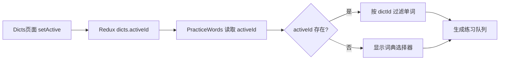
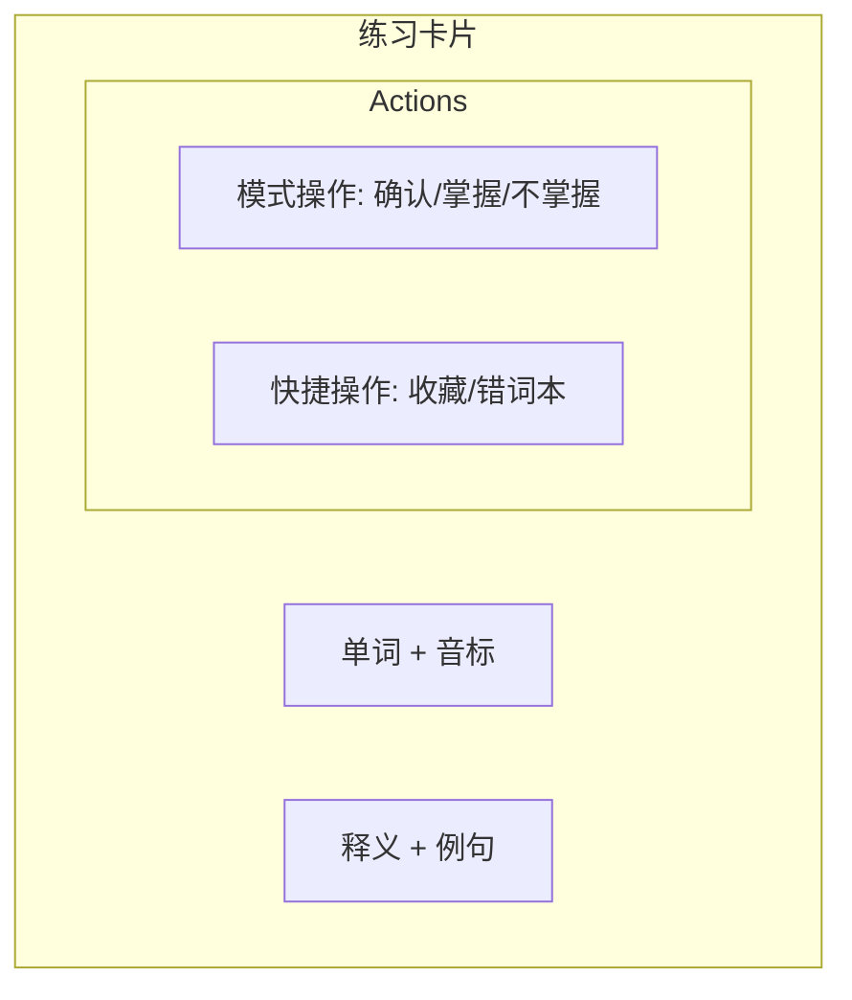
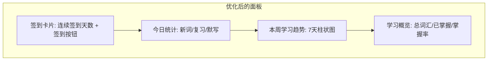
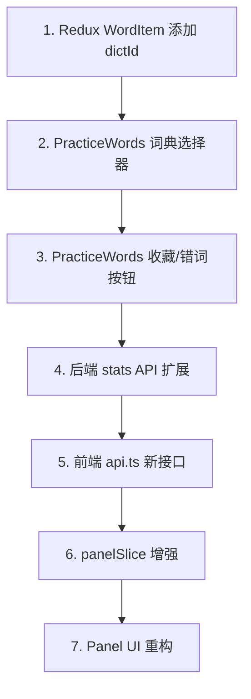

# SmileX Dict 业务逻辑优化计划

## 现状分析

### 问题总结

| # | 问题 | 现状 |
|---|------|------|
| 1 | 词典选择练习 | [`PracticeWords.tsx`](src/routes/PracticeWords.tsx) 使用全部单词，未按词典过滤；`dictsSlice.activeId` 未被使用 |
| 2 | 练习中收藏/错词 | 练习页面无收藏和错词本按钮，[`toggleCollect`](src/features/words/wordsSlice.ts:48) 和 [`markWrong`](src/features/words/wordsSlice.ts:40) action 存在但未在练习页调用 |
| 3 | 面板签到统计 | [`Panel.tsx`](src/routes/Panel.tsx) 仅展示今日数据和日期列表，无连续签到、历史统计、可视化图表 |

---

## 需求 1：选中词典进行单词练习

### 目标
用户可以在练习页面选择特定词典，仅练习该词典中的单词。

### 数据流

### 改动清单

#### 1.1 Redux [`WordItem`](src/features/words/wordsSlice.ts:6) 添加 `dictId` 字段
- 文件: `src/features/words/wordsSlice.ts`
- 在 `WordItem` 接口中添加 `dictId?: string`
- 初始数据中添加对应的 `dictId`

#### 1.2 [`PracticeWords.tsx`](src/routes/PracticeWords.tsx) 支持词典过滤
- 文件: `src/routes/PracticeWords.tsx`
- 从 Redux 读取 `dicts.activeId` 和 `dicts.mine` / `dicts.recommend`
- 添加词典选择下拉框（当未选择词典时展示）
- `queue` 的 `useMemo` 中增加 `dictId` 过滤逻辑
- 特殊词典（collected/wrong/mastered）按 `status` 过滤
- 普通词典按 `dictId` 过滤

#### 1.3 词典选择器 UI
- 在练习页顶部添加词典选择区域
- 显示当前练习的词典名称
- 支持切换词典（下拉或弹窗选择）
- 选择后重新生成练习队列，重置 `index`

---

## 需求 2：练习过程中手动添加收藏/错词本

### 目标
在单词练习的每个卡片上添加收藏和错词本快捷按钮。

### UI 设计

### 改动清单

#### 2.1 [`PracticeWords.tsx`](src/routes/PracticeWords.tsx) 添加快捷操作按钮
- 文件: `src/routes/PracticeWords.tsx`
- 在单词卡片中添加收藏按钮（星标图标）和错词本按钮
- 收藏按钮调用 [`toggleCollect`](src/features/words/wordsSlice.ts:48)
- 错词本按钮调用 [`markWrong`](src/features/words/wordsSlice.ts:40)
- 按钮需反映当前状态（已收藏高亮、已在错词本高亮）

#### 2.2 状态视觉反馈
- 已收藏的单词：星标按钮高亮（黄色填充）
- 已在错词本的单词：错词按钮高亮（红色）
- 点击后立即更新 UI，无需额外确认

---

## 需求 3：优化面板签到和统计

### 目标
增强面板页面的签到功能和统计展示，包括连续签到、历史统计、学习概览。

### UI 布局

### 改动清单

#### 3.1 后端：添加历史统计 API
- 文件: `server/main.py`
- 新增 `GET /api/stats/history?days=7` 接口
- 返回最近 N 天的统计数据列表
- 新增 `GET /api/stats/overview` 接口
- 返回总体学习概览（总词汇量、已掌握数、掌握率等）

#### 3.2 后端：[`DailyStatModel`](server/models.py:32) 扩展
- 文件: `server/models.py`
- 考虑添加 `signedIn` 字段到 `DailyStatModel`，将签到状态持久化到服务端
- 或者保持签到仅在客户端 Redux 中管理（当前方案）

#### 3.3 前端：[`panelSlice.ts`](src/features/panel/panelSlice.ts) 增强
- 文件: `src/features/panel/panelSlice.ts`
- 添加 `streak` 计算逻辑（连续签到天数）
- 添加 `historyStats` 状态存储历史数据
- 添加 `overview` 状态存储学习概览

#### 3.4 前端：[`api.ts`](src/services/api.ts) 添加新接口
- 文件: `src/services/api.ts`
- 添加 `statsApi.getHistory(days: number)` 
- 添加 `statsApi.getOverview()`

#### 3.5 前端：[`Panel.tsx`](src/routes/Panel.tsx) UI 重构
- 文件: `src/routes/Panel.tsx`
- **签到前置条件**：当天必须有学习记录（newCount + reviewCount + dictationCount > 0）才能签到，无学习记录时签到按钮禁用并提示"请先完成学习"
- **签到卡片**：显示连续签到天数（streak），大字体展示，签到按钮更醒目
- **今日统计**：保持现有三栏布局，增加与昨天的对比箭头
- **本周趋势**：获取 7 天历史数据，用简单的 CSS 柱状图展示
- **学习概览**：总词汇量、已掌握数、收藏数、错词数、掌握率百分比
- **签到日历**：用简化日历视图替代当前的日期标签列表，展示当月签到情况

---

## 实施顺序

### 步骤详情

1. **Redux 层改动** - `wordsSlice.ts` 添加 `dictId` 字段
2. **词典选择练习** - `PracticeWords.tsx` 添加词典选择和过滤逻辑
3. **练习快捷操作** - `PracticeWords.tsx` 添加收藏/错词按钮
4. **后端 API 扩展** - `server/main.py` 添加历史统计和概览接口
5. **前端 API 层** - `api.ts` 添加新接口封装
6. **Panel Slice 增强** - `panelSlice.ts` 添加 streak 和历史数据管理
7. **Panel UI 重构** - `Panel.tsx` 全面优化签到和统计展示

---

## 涉及文件汇总

| 文件 | 改动类型 |
|------|----------|
| [`src/features/words/wordsSlice.ts`](src/features/words/wordsSlice.ts) | 修改 - 添加 dictId 字段 |
| [`src/routes/PracticeWords.tsx`](src/routes/PracticeWords.tsx) | 修改 - 词典选择 + 快捷操作 |
| [`server/models.py`](server/models.py) | 修改 - 可选扩展 DailyStatModel |
| [`server/main.py`](server/main.py) | 修改 - 新增统计 API |
| [`src/services/api.ts`](src/services/api.ts) | 修改 - 新增 API 接口 |
| [`src/features/panel/panelSlice.ts`](src/features/panel/panelSlice.ts) | 修改 - 增强 state 和 actions |
| [`src/routes/Panel.tsx`](src/routes/Panel.tsx) | 修改 - UI 重构 |
| [`src/routes/Dicts.tsx`](src/routes/Dicts.tsx) | 微调 - 开始学习按钮跳转到练习页 |
