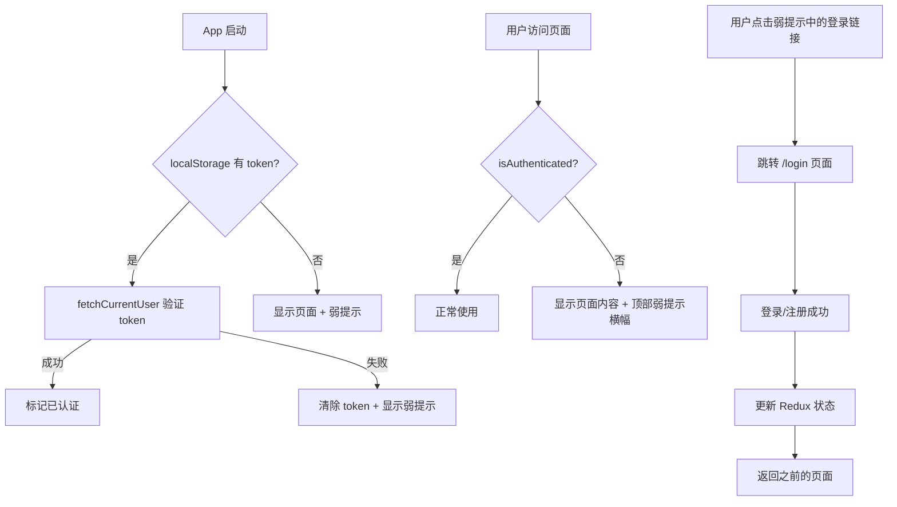

# 前端用户登录功能实现计划

## 概述

为 SmileX-Dict 前端增加用户登录功能。未登录用户可以预览页面但无法实际操作（API 调用需要认证），预览时通过弱提示引导用户登录。

## 现状分析

### 已有基础设施
- **后端认证完整**：JWT 认证已实现，register/login/me 端点可用，所有 API 端点已通过 `get_current_user` 保护
- **前端 Redux 状态**：`authSlice.ts` 已有 token/user/isAuthenticated 状态管理
- **前端 API 层**：`api.ts` 已有 `authApi` 和自动 token 注入

### 缺失部分
- 无登录/注册 UI 页面
- 无应用启动时的 token 验证
- 无路由守卫或认证提示
- 无用户信息展示和登出功能
- 无全局 401 错误处理

## 架构设计



## 页面路由设计

```mermaid
graph LR
    subgraph 公开路由
        HOME[/ 主页]
        ABOUT[/about 关于]
        STUDY[/study-guide 学习指南]
        LOGIN[/login 登录/注册]
    end
    
    subgraph 需认证路由 - 弱提示保护
        PANEL[/panel 面板]
        DICTS[/dicts 词典]
        LIBRARY[/library 书籍]
        PW[/practice/words 单词练习]
        PA[/practice/articles 文章练习]
    end
    
    LOGIN -->|成功后| HOME
```

## 详细实现步骤

### 1. 创建 Login/Register 页面组件

**文件**: `src/routes/Login.tsx`

- 单页面包含登录和注册两个 tab/表单切换
- 用户名 + 密码表单
- 调用 `authApi.login()` 或 `authApi.register()`
- 成功后 dispatch `setAuth` action
- 使用 `useNavigate` 跳转到之前页面或主页
- 使用 `useLocation` 记录来源页面以便登录后回跳
- 表单验证：用户名 3-32 字符，密码 6-64 字符
- 错误提示使用 Toast

### 2. 应用启动时 Auth 初始化

**文件**: `src/App.tsx`

- 在 `App` 组件中添加 `useEffect`
- 检查 localStorage 中是否有 token
- 如果有 token，dispatch `fetchCurrentUser` 来验证
- 验证失败则自动清除 token（`clearAuth`）
- 添加 auth 初始化加载状态，避免页面闪烁

### 3. 创建 AuthGuard 组件（弱提示模式）

**文件**: `src/components/AuthGuard.tsx`

设计思路：
- **不是硬拦截**：不阻止用户查看页面内容
- **弱提示横幅**：在页面顶部显示一个可关闭的提示横幅
- 横幅内容：「登录后即可使用完整功能」+ 登录按钮
- 横幅样式：使用柔和的颜色（如 amber/warning 色调），不遮挡主要内容
- 横幅可以关闭，但刷新后重新出现
- 对于需要认证的操作（如 API 调用失败），再次弹出提示

组件接口：
```typescript
interface AuthGuardProps {
  children: ReactNode
}
```

实现：
- 读取 Redux `isAuthenticated` 状态
- 如果已认证，直接渲染 children
- 如果未认证，渲染 children + 顶部弱提示横幅
- 横幅使用 `fixed` 或 `sticky` 定位在顶部导航栏下方

### 4. Header 用户信息展示

**文件**: `src/App.tsx`（修改 header 部分）

- 已认证时：在 header 右侧显示用户名 + 登出按钮
- 未认证时：在 header 右侧显示「登录」按钮
- 登出操作：dispatch `clearAuth` + 调用 `authApi.logout()`
- 移动端也需要适配

### 5. 全局 401 错误处理

**文件**: `src/services/api.ts`

- 在 `request` 函数中，当收到 401 响应时：
  - 清除本地 token
  - dispatch `clearAuth` action（需要通过回调或事件机制）
  - 不跳转页面（因为是弱提示模式）
- 实现方式：添加一个全局的 auth error callback 机制
  - 在 `api.ts` 中导出 `setOnAuthError` 函数
  - 在 `App.tsx` 中设置该回调

### 6. 路由配置更新

**文件**: `src/App.tsx`

- 添加 `/login` 路由指向 `Login` 组件
- 将需要认证的页面用 `AuthGuard` 包裹
- 公开页面（主页、关于、学习指南）不需要 AuthGuard
- 实际上，由于是弱提示模式，所有页面都可以访问，只是认证页面会显示提示

### 7. Auth Slice 增强

**文件**: `src/features/auth/authSlice.ts`

- 添加 `initAuth` async thunk：检查 token 并验证
- 确保 `fetchCurrentUser` 的 rejected case 正确清理状态

## 弱提示 UI 设计

```
┌──────────────────────────────────────────────────────┐
│ 😊 SmileX Dict            主页 面板 词典 书籍  [登录] │  ← Header
├──────────────────────────────────────────────────────┤
│ 💡 登录后即可使用完整功能，数据多端同步  [立即登录] ✕  │  ← 弱提示横幅（amber 色）
├──────────────────────────────────────────────────────┤
│                                                      │
│  （页面正常内容，可以预览）                              │
│                                                      │
└──────────────────────────────────────────────────────┘
```

横幅特点：
- 使用 `bg-amber-50 border-amber-200` 柔和色调
- 包含提示文字 + 登录按钮 + 关闭按钮
- `sticky` 定位，不遮挡 header
- 关闭后当前会话不再显示（使用组件 state）
- 页面刷新后重新出现

## 文件变更清单

| 文件 | 操作 | 说明 |
|------|------|------|
| `src/routes/Login.tsx` | 新建 | 登录/注册页面 |
| `src/components/AuthGuard.tsx` | 新建 | 认证守卫组件（弱提示） |
| `src/App.tsx` | 修改 | 添加 auth 初始化、Login 路由、AuthGuard 包裹、header 用户信息 |
| `src/features/auth/authSlice.ts` | 修改 | 添加 initAuth thunk |
| `src/services/api.ts` | 修改 | 添加全局 401 处理回调 |

## 用户流程

1. **首次访问**：用户打开应用 → 无 token → 显示页面 + 弱提示横幅 → header 显示「登录」按钮
2. **点击登录**：跳转 /login → 填写表单 → 登录成功 → 跳回原页面 → 弱提示消失
3. **关闭提示**：用户关闭弱提示 → 继续浏览 → 但无法执行需要认证的操作
4. **操作失败**：用户尝试操作 → API 返回 401 → 弱提示再次出现
5. **已登录状态**：正常使用 → header 显示用户名 + 登出按钮
6. **Token 过期**：API 返回 401 → 自动清除认证状态 → 弱提示出现
