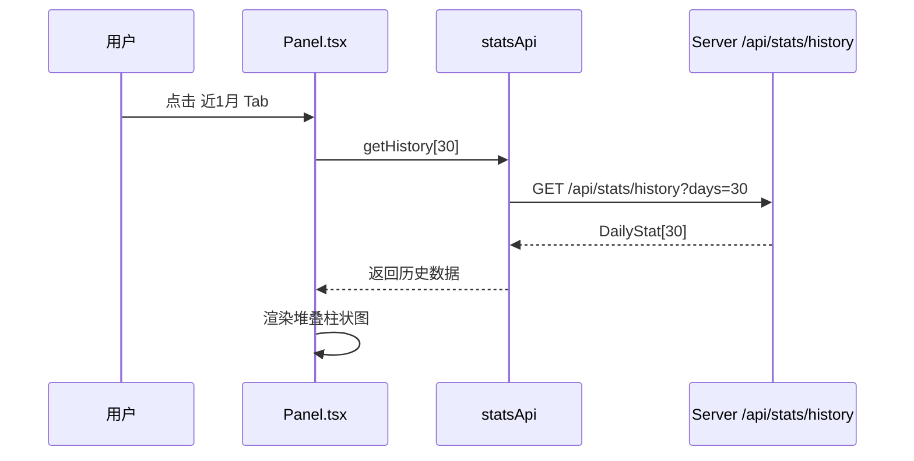
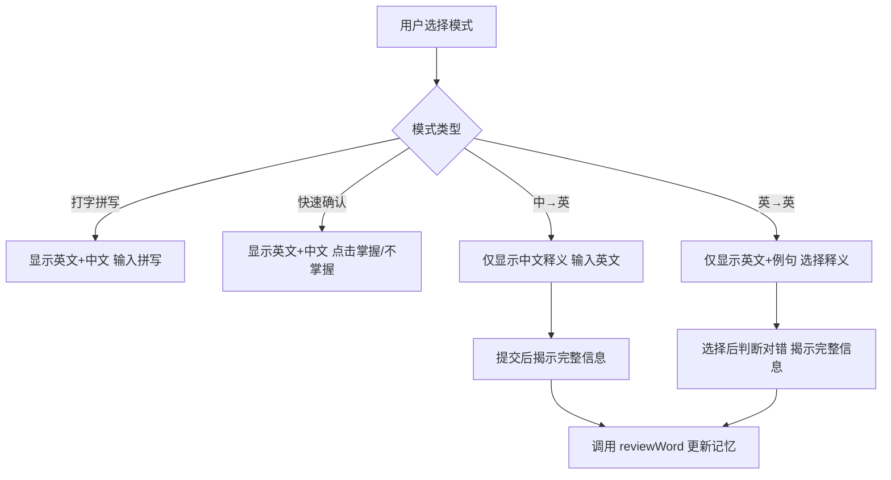

# SmileX Dict 学习增强计划

## 概述

本计划涵盖4个核心需求的实现，旨在全面提升单词学习体验：趋势面板增强、学习分类统计、记忆模式扩展、以及科学记忆方法的引入。

---

## 需求1: 面板学习趋势增加时间范围筛选

### 现状分析
- [`Panel.tsx`](src/routes/Panel.tsx:116) 中"本周学习趋势"硬编码为 `stats.slice(-7)`，仅展示最近7天
- 后端仅有 [`GET /api/stats/today`](server/main.py:222) 接口，无历史数据查询
- [`panelSlice.ts`](src/features/panel/panelSlice.ts:14) 已有 `historyStats` 字段但未使用

### 改动清单

#### 后端 (server/)
1. **新增历史统计接口** - 在 [`server/main.py`](server/main.py) 中添加:
   - `GET /api/stats/history?days=7` — 支持 `days` 参数（7/30/180）
   - 返回指定天数内的 `DailyStat[]`，缺失日期补零
   - 需要新增 `wrongCount` 字段（与需求2合并）

2. **数据库迁移** - 在 [`DailyStatModel`](server/models.py:48) 中:
   - 新增 `wrongCount = Column(Integer, default=0)` 字段
   - 处理已有数据的迁移（默认值0）

#### 前端 API 层
3. **更新 API 服务** - 在 [`src/services/api.ts`](src/services/api.ts:131) 中:
   - `DailyStat` 接口新增 `wrongCount: number`
   - `statsApi` 新增 `getHistory(days: number)` 方法

#### 前端面板
4. **改造趋势图** - 在 [`Panel.tsx`](src/routes/Panel.tsx:116) 中:
   - 添加时间范围 Tab 切换组件：`近7天` | `近1月` | `近半年`
   - 根据选中范围调用 `statsApi.getHistory(days)` 获取数据
   - 趋势图改为**堆叠柱状图**，分别显示新词/复习/错词/默写（与需求2合并）
   - 30天和180天视图下，X轴日期标签做间隔显示避免拥挤

### 数据流示意



---

## 需求2: 学习分类统计（复习/新词/每日错词）

### 现状分析
- [`PracticeWords.tsx`](src/routes/PracticeWords.tsx:90) 已发送 `new`、`review`、`dictation` 三种事件
- 错词仅在单词级别标记（`status='wrong'`），未在每日统计中记录
- 趋势图只显示总量，未区分新词/复习/错词

### 改动清单

#### 后端
1. **扩展统计事件类型** - 在 [`server/main.py`](server/main.py:232) 的 `add_event` 中:
   - 新增 `wrong` 事件类型处理：`row.wrongCount += 1`
   - 更新 `StatItem` schema 增加 `wrongCount` 字段

2. **更新今日统计接口** - [`GET /api/stats/today`](server/main.py:222) 返回值包含 `wrongCount`

#### 前端练习页
3. **发送错词事件** - 在 [`PracticeWords.tsx`](src/routes/PracticeWords.tsx:66) 中:
   - `submitType()` 中回答错误时，额外发送 `{ type: 'wrong' }` 事件
   - `submitConfirm()` 中选择"不掌握"时，额外发送 `{ type: 'wrong' }` 事件

#### 前端面板
4. **堆叠趋势图** - 在 [`Panel.tsx`](src/routes/Panel.tsx:121) 趋势图中:
   - 每个柱子分4段：新词（蓝色）、复习（绿色）、错词（红色）、默写（橙色）
   - 悬停显示具体数值

5. **今日统计卡片增强** - 在 [`Panel.tsx`](src/routes/Panel.tsx:92) 中:
   - 新增"错词数"卡片，4列布局：新词 | 复习 | 默写 | 错词

### 趋势图堆叠效果示意

```
┌─────────────────────────────────────────────┐
│  近7天  |  近1月  |  近半年                    │
├─────────────────────────────────────────────┤
│       ▓▓ ▓▓                                   │
│    ▓▓ ▓▓ ▓▓ ▓▓                                │
│ ▓▓ ▓▓ ▓▓ ▓▓ ▓▓ ▓▓  ← 堆叠:                  │
│ ░░ ░░ ░░ ░░ ░░ ░░     ███ 新词 [蓝]          │
│ ░░ ░░ ░░ ░░ ░░ ░░     ███ 复习 [绿]          │
│                        ███ 默写 [橙]          │
│  一  二  三  四  五      ███ 错词 [红]          │
└─────────────────────────────────────────────┘
```

---

## 需求3: 增加英英模式和中英模式

### 现状分析
- [`PracticeWords.tsx`](src/routes/PracticeWords.tsx:8) 当前有两种模式：`type`（打字拼写）和 `confirm`（快速确认）
- 两种模式都同时展示英文单词和中文释义
- 缺少主动回忆（active recall）的方向性控制

### 模式设计

| 模式 | 展示内容 | 用户操作 | 训练目标 |
|------|---------|---------|---------|
| 打字拼写 | 英文+音标+中文 | 输入英文拼写 | 拼写能力 |
| 快速确认 | 英文+音标+中文 | 点击掌握/不掌握 | 快速过词 |
| **中→英模式** | 中文释义 | 输入或选择对应英文 | 主动回忆英文 |
| **英→英模式** | 英文单词+英文例句 | 输入或选择中文/英文释义 | 英文理解力 |

### 改动清单

#### 前端练习页
1. **扩展 Mode 类型** - 在 [`PracticeWords.tsx`](src/routes/PracticeWords.tsx:8):
   ```typescript
   type Mode = 'type' | 'confirm' | 'zh-en' | 'en-en'
   ```

2. **中→英模式 (zh-en)** 实现:
   - 展示：中文释义（`meaning`）+ 音标（`ipa`）
   - 隐藏：英文单词（`term`）
   - 用户输入英文单词，与 `term` 比对
   - 提交后揭示完整信息（英文+例句+同义词）

3. **英→英模式 (en-en)** 实现:
   - 展示：英文单词（`term`）+ 英文例句（`example`）
   - 隐藏：中文释义（`meaning`）
   - 用户需要回忆中文含义，可以选择题形式（从4个选项中选择正确释义）
   - 选项从当前词库的其他单词的 `meaning` 中随机抽取作为干扰项

4. **模式切换 UI** - 更新模式按钮组:
   ```
   [打字拼写] [快速确认] [中→英] [英→英]
   ```

5. **选择题逻辑** - 英英模式需要:
   - 从当前词库中随机抽取3个其他单词的 meaning 作为干扰项
   - 正确答案 + 3个干扰项随机排列
   - 点击选项后判断对错

### 交互流程



---

## 需求4: 推荐并实现科学记忆方法

### 现状分析
- [`wordsSlice.ts`](src/features/words/wordsSlice.ts:71) 已实现 **SM-2 算法**（SuperMemo 2）
- SM-2 是一种自适应间隔重复算法，通过 `efactor`（记忆因子）和 `interval`（间隔天数）动态调整复习计划
- 用户无法感知或选择记忆策略

### 推荐记忆方法对比

| 方法 | 核心原理 | 优点 | 缺点 | 适合场景 |
|------|---------|------|------|---------|
| **SM-2 已实现** | 自适应间隔，根据回答质量调整EF因子 | 个性化强，效率高 | 需要用户认真评分 | 长期记忆 |
| **艾宾浩斯固定周期** | 固定间隔：1,2,4,7,15,30天 | 简单直观，易理解 | 不够灵活，不考虑个体差异 | 初学者/入门 |
| **Leitner 盒子系统** | 5个盒子，答对升盒，答错回盒1 | 游戏化，有成就感 | 粒度较粗 | 趣味学习 |
| **Anki 改进版 SM-2** | 在 SM-2 基础上增加衰减模型 | 更精确的遗忘曲线 | 实现复杂 | 高级用户 |

### 推荐方案

**保留当前 SM-2 作为默认算法**，同时增加以下增强：

1. **艾宾浩斯复习提醒** - 在 Panel 面板增加今日复习日历视图
   - 显示按艾宾浩斯周期（1,2,4,7,15,30天）预计需要复习的单词数
   - 作为 SM-2 的补充可视化，帮助用户理解复习节奏

2. **学习策略说明页** - 在关于页面或新增"学习指南"页面:
   - 解释当前使用的 SM-2 算法原理
   - 展示遗忘曲线示意图
   - 给出学习建议（每日学习量、最佳复习时间等）

### 改动清单

#### 前端
1. **Panel 增加复习日历/预测** - 在 [`Panel.tsx`](src/routes/Panel.tsx) 中:
   - 新增"复习预测"卡片，基于每个单词的 `nextReviewDate` 展示未来7天的预计复习量
   - 用小型日历或条形图展示

2. **学习指南页面** - 新建 `src/routes/StudyGuide.tsx`:
   - SM-2 算法原理说明
   - 艾宾浩斯遗忘曲线图示
   - 学习建议和最佳实践
   - 在导航中添加入口

3. **路由注册** - 在 [`App.tsx`](src/App.tsx.tsx:87) 中添加新路由

### 复习预测示意

```
┌─────────────────────────────┐
│ 复习预测                     │
├─────────────────────────────┤
│ 今天  ████░░░░  12词        │
│ 明天  ██░░░░░░   5词        │
│ 后天  ███░░░░░   8词        │
│ ...                         │
│ 3天后 ██████░░  15词        │
│ 7天后 ███░░░░░   9词        │
└─────────────────────────────┘
```

---

## 实施顺序

按依赖关系排序的实施步骤：

### Phase 1: 后端基础设施
1. `DailyStatModel` 新增 `wrongCount` 字段
2. 新增 `GET /api/stats/history?days=N` 接口
3. 更新 `POST /api/stats/event` 支持 `wrong` 类型
4. 数据库迁移处理

### Phase 2: 前端 API 与状态层
5. 更新 [`api.ts`](src/services/api.ts) 中 `DailyStat` 接口和 `statsApi`
6. 更新 [`panelSlice.ts`](src/features/panel/panelSlice.ts) 支持历史数据存储

### Phase 3: 面板趋势增强（需求1+2）
7. Panel.tsx 添加时间范围 Tab 组件
8. Panel.tsx 趋势图改为堆叠柱状图
9. Panel.tsx 今日统计增加错词卡片
10. PracticeWords.tsx 发送错词事件

### Phase 4: 记忆模式扩展（需求3）
11. 扩展 PracticeWords Mode 类型
12. 实现中→英模式 UI 和逻辑
13. 实现英→英模式 UI 和选择题逻辑
14. 更新模式切换按钮组

### Phase 5: 记忆方法推荐（需求4）
15. Panel.tsx 新增复习预测卡片
16. 新建 StudyGuide.tsx 学习指南页面
17. App.tsx 注册路由和导航

---

## 文件改动汇总

| 文件 | 改动类型 | 说明 |
|------|---------|------|
| [`server/models.py`](server/models.py:48) | 修改 | DailyStatModel 新增 wrongCount |
| [`server/main.py`](server/main.py:232) | 修改 | 新增 history 接口，event 支持 wrong |
| [`src/services/api.ts`](src/services/api.ts:131) | 修改 | DailyStat 新增 wrongCount，新增 getHistory |
| [`src/features/panel/panelSlice.ts`](src/features/panel/panelSlice.ts) | 修改 | 支持历史数据状态管理 |
| [`src/routes/Panel.tsx`](src/routes/Panel.tsx) | 修改 | 时间筛选、堆叠图、错词统计、复习预测 |
| [`src/routes/PracticeWords.tsx`](src/routes/PracticeWords.tsx) | 修改 | 新增 zh-en/en-en 模式、发送错词事件 |
| [`src/routes/StudyGuide.tsx`](src/routes/StudyGuide.tsx) | 新建 | 学习指南页面 |
| [`src/App.tsx`](src/App.tsx) | 修改 | 注册新路由 |

---

## 技术注意事项

1. **数据库迁移**: SQLite 不支持 `ALTER TABLE ADD COLUMN` 带 default 以外的约束，需确保 `wrongCount` 有默认值 0
2. **图表渲染**: 30天和180天的堆叠图数据点较多，考虑使用 CSS 渲染而非引入重量级图表库
3. **选择题干扰项**: 英英模式需确保词库中有足够单词（>=4）才能生成有效选项，否则降级为输入模式
4. **SM-2 兼容性**: 新增模式不影响现有 SM-2 评分逻辑，所有模式共用同一套记忆调度算法
