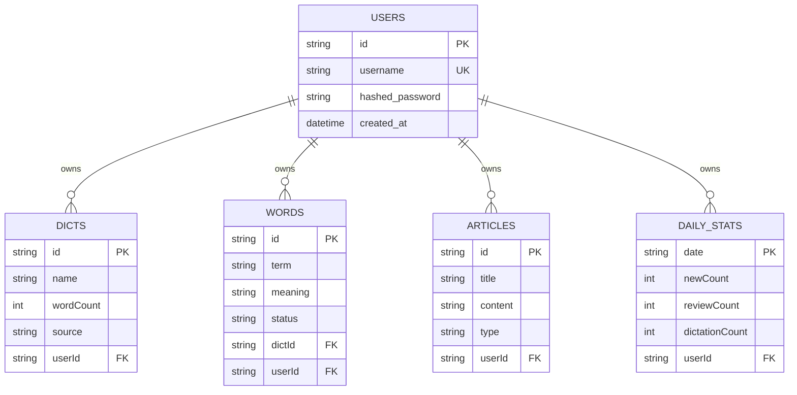
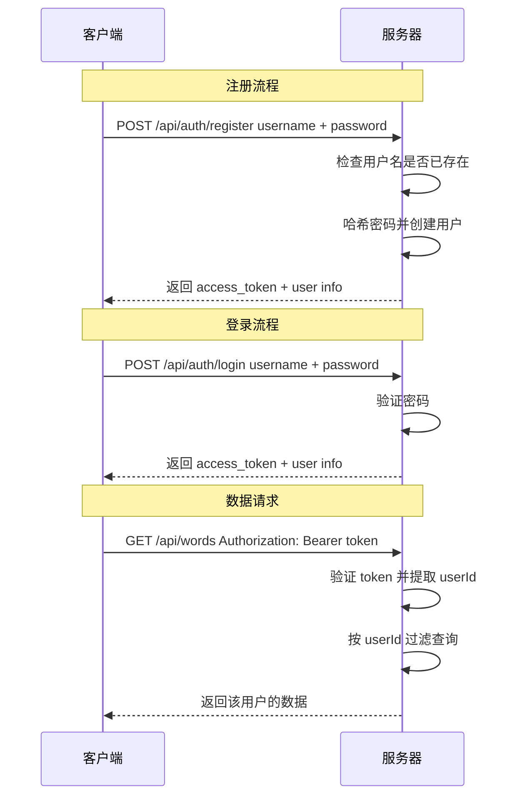

# 用户管理功能实现计划

## 概述

为 SmileX-Dict 添加完整的用户管理系统，使用 JWT Token + 用户名/密码认证，所有数据按用户隔离，支持多端同步。

## 架构设计

```mermaid
graph TD
    A[前端 React App] -->|携带 JWT Token| B[FastAPI 后端]
    B -->|验证 Token| C[JWT Auth Middleware]
    C -->|提取 userId| D[API 路由处理]
    D -->|按 userId 过滤| E[SQLite 数据库]
    
    subgraph 前端
        F[Login/Register 页面] --> G[Auth Redux Slice]
        G --> H[Token 存储 - localStorage]
        I[API Service] -->|自动附加 Token| H
    end
    
    subgraph 后端
        J[/api/auth/register] --> K[创建用户 + 返回 Token]
        L[/api/auth/login] --> K
        M[所有 /api/* 路由] --> N[get_current_user 依赖]
    end
```

## 数据模型变更



## 认证流程



---

## 实施步骤

### 第一阶段：后端改造

#### 1. 添加 Python 依赖

在 [`server/pyproject.toml`](server/pyproject.toml) 中添加：
- `python-jose[cryptography]` - JWT 编解码
- `passlib[bcrypt]` - 密码哈希
- `python-multipart` - 表单数据解析

#### 2. 创建 UserModel

在 [`server/models.py`](server/models.py) 中添加 `UserModel`：
- `id`: String, 主键（UUID 格式）
- `username`: String, 唯一索引
- `hashed_password`: String
- `created_at`: DateTime

同时为以下模型添加 `userId` 外键列：
- `DictItemModel` → 添加 `userId` FK
- `WordItemModel` → 添加 `userId` FK
- `ArticleItemModel` → 添加 `userId` FK
- `DailyStatModel` → 将主键改为联合主键 `(date, userId)`

#### 3. 创建认证模块

新建 `server/auth.py`，包含：
- `SECRET_KEY` 和 `ALGORITHM` 配置
- `hash_password(password)` - 密码哈希
- `verify_password(plain, hashed)` - 密码验证
- `create_access_token(data, expires_delta)` - 创建 JWT
- `get_current_user(token, db)` - FastAPI 依赖，从 token 解析用户

#### 4. 添加认证 API 端点

在 [`server/main.py`](server/main.py) 中添加：
- `POST /api/auth/register` - 注册新用户
- `POST /api/auth/login` - 登录获取 token
- `GET /api/auth/me` - 获取当前用户信息

#### 5. 改造现有 API 端点

修改所有现有端点，添加 `current_user: UserModel = Depends(get_current_user)` 依赖：
- 所有查询添加 `.filter(Model.userId == current_user.id)` 条件
- 所有创建操作自动设置 `userId = current_user.id`
- 包括：dicts、words、articles、stats 的所有端点

#### 6. 数据迁移

由于 SQLite 已有数据，需要处理迁移：
- 创建一个默认用户（如 `default`）
- 将现有数据的 `userId` 设为默认用户
- 或者直接重建数据库（如果是开发阶段）

---

### 第二阶段：前端改造

#### 7. 添加 Auth API 服务

在 [`src/services/api.ts`](src/services/api.ts) 中添加：
- `authApi.register(username, password)` 
- `authApi.login(username, password)`
- `authApi.getMe()`
- 修改 `request()` 函数，自动从 localStorage 读取 token 并附加到请求头

#### 8. 添加 Auth Redux Slice

新建 `src/features/auth/authSlice.ts`：
```typescript
interface AuthState {
  token: string | null
  user: { id: string; username: string } | null
  isAuthenticated: boolean
}
```
- Actions: `setAuth`, `clearAuth`, `login`, `register`
- Token 持久化到 localStorage

#### 9. 更新 Redux Store

修改 [`src/store/index.ts`](src/store/index.ts)：
- 引入 authReducer
- 将 auth 加入 persist whitelist

#### 10. 创建登录/注册页面

新建 `src/routes/Login.tsx` 和 `src/routes/Register.tsx`：
- 简洁的表单界面，与现有 UI 风格一致
- 登录/注册互相跳转的链接
- 错误提示

#### 11. 添加路由守卫

修改 [`src/App.tsx`](src/App.tsx)：
- 创建 `PrivateRoute` 组件，未登录时重定向到 `/login`
- 将需要认证的路由包裹在 `PrivateRoute` 中
- `/login` 和 `/register` 路由不需要认证

#### 12. 更新导航栏

修改 [`src/App.tsx`](src/App.tsx) 的 header 部分：
- 显示当前登录用户名
- 添加退出登录按钮

#### 13. 多端同步数据流改造

当前数据存储在两个地方：
- **Redux + localStorage**（前端本地持久化）
- **SQLite**（后端数据库）

为了支持多端同步，数据流需要调整为：
1. 登录后从服务器拉取所有数据
2. 本地操作实时同步到服务器
3. Redux 作为客户端缓存层，服务器为数据源
4. 页面加载时优先从服务器获取最新数据

具体改动：
- 修改各 Slice 的初始化逻辑，登录后从 API 加载数据
- 添加 `fetchWords`、`fetchDicts`、`fetchArticles` 等 async thunks
- 保持 Redux-persist 作为离线缓存

---

## 文件变更清单

### 新增文件
| 文件 | 说明 |
|------|------|
| `server/auth.py` | 认证工具模块（JWT、密码哈希） |
| `src/features/auth/authSlice.ts` | Auth Redux Slice |
| `src/routes/Login.tsx` | 登录页面 |
| `src/routes/Register.tsx` | 注册页面 |

### 修改文件
| 文件 | 变更内容 |
|------|----------|
| `server/pyproject.toml` | 添加 JWT 和密码哈希依赖 |
| `server/models.py` | 添加 UserModel，所有模型添加 userId |
| `server/main.py` | 添加认证端点，所有端点添加用户过滤 |
| `server/db.py` | 无需修改 |
| `src/services/api.ts` | 添加 auth API，请求自动带 token |
| `src/store/index.ts` | 引入 authReducer |
| `src/App.tsx` | 添加路由守卫、登录/注册路由、用户信息展示 |
| `src/features/words/wordsSlice.ts` | 添加 fetchWords async thunk |
| `src/features/dicts/dictsSlice.ts` | 添加 fetchDicts async thunk |
| `src/features/articles/articlesSlice.ts` | 添加 fetchArticles async thunk |

---

## 安全考虑

1. **密码存储**：使用 bcrypt 哈希，不存储明文密码
2. **JWT Token**：设置合理过期时间（如 7 天），使用强密钥
3. **CORS**：生产环境应限制 `allow_origins`
4. **输入验证**：用户名长度限制、密码强度要求
5. **Token 刷新**：可考虑添加 refresh token 机制（后续优化）

## 注意事项

- 现有 SQLite 数据库需要迁移，建议开发阶段直接重建
- `DailyStatModel` 的主键需要从单一 `date` 改为联合主键 `(date, userId)`
- 前端 Redux-persist 的 key 需要考虑多用户场景（不同用户不应共享 localStorage 缓存）

## 概述

为 SmileX-Dict 添加完整的用户管理系统，使用 JWT Token + 用户名/密码认证，所有数据按用户隔离，支持多端同步。

## 架构设计

```mermaid
graph TD
    A[前端 React App] -->|携带 JWT Token| B[FastAPI 后端]
    B -->|验证 Token| C[JWT Auth Middleware]
    C -->|提取 userId| D[API 路由处理]
    D -->|按 userId 过滤| E[SQLite 数据库]
    
    subgraph 前端
        F[Login/Register 页面] --> G[Auth Redux Slice]
        G --> H[Token 存储 - localStorage]
        I[API Service] -->|自动附加 Token| H
    end
    
    subgraph 后端
        J[/api/auth/register] --> K[创建用户 + 返回 Token]
        L[/api/auth/login] --> K
        M[所有 /api/* 路由] --> N[get_current_user 依赖]
    end
```

## 数据模型变更


## 认证流程


---

## 实施步骤

### 第一阶段：后端改造

#### 1. 添加 Python 依赖

在 [`server/pyproject.toml`](server/pyproject.toml) 中添加：
- `python-jose[cryptography]` - JWT 编解码
- `passlib[bcrypt]` - 密码哈希
- `python-multipart` - 表单数据解析

#### 2. 创建 UserModel

在 [`server/models.py`](server/models.py) 中添加 `UserModel`：
- `id`: String, 主键（UUID 格式）
- `username`: String, 唯一索引
- `hashed_password`: String
- `created_at`: DateTime

同时为以下模型添加 `userId` 外键列：
- `DictItemModel` → 添加 `userId` FK
- `WordItemModel` → 添加 `userId` FK
- `ArticleItemModel` → 添加 `userId` FK
- `DailyStatModel` → 将主键改为联合主键 `(date, userId)`

#### 3. 创建认证模块

新建 `server/auth.py`，包含：
- `SECRET_KEY` 和 `ALGORITHM` 配置
- `hash_password(password)` - 密码哈希
- `verify_password(plain, hashed)` - 密码验证
- `create_access_token(data, expires_delta)` - 创建 JWT
- `get_current_user(token, db)` - FastAPI 依赖，从 token 解析用户

#### 4. 添加认证 API 端点

在 [`server/main.py`](server/main.py) 中添加：
- `POST /api/auth/register` - 注册新用户
- `POST /api/auth/login` - 登录获取 token
- `GET /api/auth/me` - 获取当前用户信息

#### 5. 改造现有 API 端点

修改所有现有端点，添加 `current_user: UserModel = Depends(get_current_user)` 依赖：
- 所有查询添加 `.filter(Model.userId == current_user.id)` 条件
- 所有创建操作自动设置 `userId = current_user.id`
- 包括：dicts、words、articles、stats 的所有端点

#### 6. 数据迁移

由于 SQLite 已有数据，需要处理迁移：
- 创建一个默认用户（如 `default`）
- 将现有数据的 `userId` 设为默认用户
- 或者直接重建数据库（如果是开发阶段）

---

### 第二阶段：前端改造

#### 7. 添加 Auth API 服务

在 [`src/services/api.ts`](src/services/api.ts) 中添加：
- `authApi.register(username, password)` 
- `authApi.login(username, password)`
- `authApi.getMe()`
- 修改 `request()` 函数，自动从 localStorage 读取 token 并附加到请求头

#### 8. 添加 Auth Redux Slice

新建 `src/features/auth/authSlice.ts`：
```typescript
interface AuthState {
  token: string | null
  user: { id: string; username: string } | null
  isAuthenticated: boolean
}
```
- Actions: `setAuth`, `clearAuth`, `login`, `register`
- Token 持久化到 localStorage

#### 9. 更新 Redux Store

修改 [`src/store/index.ts`](src/store/index.ts)：
- 引入 authReducer
- 将 auth 加入 persist whitelist

#### 10. 创建登录/注册页面

新建 `src/routes/Login.tsx` 和 `src/routes/Register.tsx`：
- 简洁的表单界面，与现有 UI 风格一致
- 登录/注册互相跳转的链接
- 错误提示

#### 11. 添加路由守卫

修改 [`src/App.tsx`](src/App.tsx)：
- 创建 `PrivateRoute` 组件，未登录时重定向到 `/login`
- 将需要认证的路由包裹在 `PrivateRoute` 中
- `/login` 和 `/register` 路由不需要认证

#### 12. 更新导航栏

修改 [`src/App.tsx`](src/App.tsx) 的 header 部分：
- 显示当前登录用户名
- 添加退出登录按钮

#### 13. 多端同步数据流改造

当前数据存储在两个地方：
- **Redux + localStorage**（前端本地持久化）
- **SQLite**（后端数据库）

为了支持多端同步，数据流需要调整为：
1. 登录后从服务器拉取所有数据
2. 本地操作实时同步到服务器
3. Redux 作为客户端缓存层，服务器为数据源
4. 页面加载时优先从服务器获取最新数据

具体改动：
- 修改各 Slice 的初始化逻辑，登录后从 API 加载数据
- 添加 `fetchWords`、`fetchDicts`、`fetchArticles` 等 async thunks
- 保持 Redux-persist 作为离线缓存

---

## 文件变更清单

### 新增文件
| 文件 | 说明 |
|------|------|
| `server/auth.py` | 认证工具模块（JWT、密码哈希） |
| `src/features/auth/authSlice.ts` | Auth Redux Slice |
| `src/routes/Login.tsx` | 登录页面 |
| `src/routes/Register.tsx` | 注册页面 |

### 修改文件
| 文件 | 变更内容 |
|------|----------|
| `server/pyproject.toml` | 添加 JWT 和密码哈希依赖 |
| `server/models.py` | 添加 UserModel，所有模型添加 userId |
| `server/main.py` | 添加认证端点，所有端点添加用户过滤 |
| `server/db.py` | 无需修改 |
| `src/services/api.ts` | 添加 auth API，请求自动带 token |
| `src/store/index.ts` | 引入 authReducer |
| `src/App.tsx` | 添加路由守卫、登录/注册路由、用户信息展示 |
| `src/features/words/wordsSlice.ts` | 添加 fetchWords async thunk |
| `src/features/dicts/dictsSlice.ts` | 添加 fetchDicts async thunk |
| `src/features/articles/articlesSlice.ts` | 添加 fetchArticles async thunk |

---

## 安全考虑

1. **密码存储**：使用 bcrypt 哈希，不存储明文密码
2. **JWT Token**：设置合理过期时间（如 7 天），使用强密钥
3. **CORS**：生产环境应限制 `allow_origins`
4. **输入验证**：用户名长度限制、密码强度要求
5. **Token 刷新**：可考虑添加 refresh token 机制（后续优化）

## 注意事项

- 现有 SQLite 数据库需要迁移，建议开发阶段直接重建
- `DailyStatModel` 的主键需要从单一 `date` 改为联合主键 `(date, userId)`
- 前端 Redux-persist 的 key 需要考虑多用户场景（不同用户不应共享 localStorage 缓存）

## 概述

为 SmileX-Dict 添加完整的用户管理系统，使用 JWT Token + 用户名/密码认证，所有数据按用户隔离，支持多端同步。

## 架构设计

```mermaid
graph TD
    A[前端 React App] -->|携带 JWT Token| B[FastAPI 后端]
    B -->|验证 Token| C[JWT Auth Middleware]
    C -->|提取 userId| D[API 路由处理]
    D -->|按 userId 过滤| E[SQLite 数据库]
    
    subgraph 前端
        F[Login/Register 页面] --> G[Auth Redux Slice]
        G --> H[Token 存储 - localStorage]
        I[API Service] -->|自动附加 Token| H
    end
    
    subgraph 后端
        J[/api/auth/register] --> K[创建用户 + 返回 Token]
        L[/api/auth/login] --> K
        M[所有 /api/* 路由] --> N[get_current_user 依赖]
    end
```

## 数据模型变更


## 认证流程


---

## 实施步骤

### 第一阶段：后端改造

#### 1. 添加 Python 依赖

在 [`server/pyproject.toml`](server/pyproject.toml) 中添加：
- `python-jose[cryptography]` - JWT 编解码
- `passlib[bcrypt]` - 密码哈希
- `python-multipart` - 表单数据解析

#### 2. 创建 UserModel

在 [`server/models.py`](server/models.py) 中添加 `UserModel`：
- `id`: String, 主键（UUID 格式）
- `username`: String, 唯一索引
- `hashed_password`: String
- `created_at`: DateTime

同时为以下模型添加 `userId` 外键列：
- `DictItemModel` → 添加 `userId` FK
- `WordItemModel` → 添加 `userId` FK
- `ArticleItemModel` → 添加 `userId` FK
- `DailyStatModel` → 将主键改为联合主键 `(date, userId)`

#### 3. 创建认证模块

新建 `server/auth.py`，包含：
- `SECRET_KEY` 和 `ALGORITHM` 配置
- `hash_password(password)` - 密码哈希
- `verify_password(plain, hashed)` - 密码验证
- `create_access_token(data, expires_delta)` - 创建 JWT
- `get_current_user(token, db)` - FastAPI 依赖，从 token 解析用户

#### 4. 添加认证 API 端点

在 [`server/main.py`](server/main.py) 中添加：
- `POST /api/auth/register` - 注册新用户
- `POST /api/auth/login` - 登录获取 token
- `GET /api/auth/me` - 获取当前用户信息

#### 5. 改造现有 API 端点

修改所有现有端点，添加 `current_user: UserModel = Depends(get_current_user)` 依赖：
- 所有查询添加 `.filter(Model.userId == current_user.id)` 条件
- 所有创建操作自动设置 `userId = current_user.id`
- 包括：dicts、words、articles、stats 的所有端点

#### 6. 数据迁移

由于 SQLite 已有数据，需要处理迁移：
- 创建一个默认用户（如 `default`）
- 将现有数据的 `userId` 设为默认用户
- 或者直接重建数据库（如果是开发阶段）

---

### 第二阶段：前端改造

#### 7. 添加 Auth API 服务

在 [`src/services/api.ts`](src/services/api.ts) 中添加：
- `authApi.register(username, password)` 
- `authApi.login(username, password)`
- `authApi.getMe()`
- 修改 `request()` 函数，自动从 localStorage 读取 token 并附加到请求头

#### 8. 添加 Auth Redux Slice

新建 `src/features/auth/authSlice.ts`：
```typescript
interface AuthState {
  token: string | null
  user: { id: string; username: string } | null
  isAuthenticated: boolean
}
```
- Actions: `setAuth`, `clearAuth`, `login`, `register`
- Token 持久化到 localStorage

#### 9. 更新 Redux Store

修改 [`src/store/index.ts`](src/store/index.ts)：
- 引入 authReducer
- 将 auth 加入 persist whitelist

#### 10. 创建登录/注册页面

新建 `src/routes/Login.tsx` 和 `src/routes/Register.tsx`：
- 简洁的表单界面，与现有 UI 风格一致
- 登录/注册互相跳转的链接
- 错误提示

#### 11. 添加路由守卫

修改 [`src/App.tsx`](src/App.tsx)：
- 创建 `PrivateRoute` 组件，未登录时重定向到 `/login`
- 将需要认证的路由包裹在 `PrivateRoute` 中
- `/login` 和 `/register` 路由不需要认证

#### 12. 更新导航栏

修改 [`src/App.tsx`](src/App.tsx) 的 header 部分：
- 显示当前登录用户名
- 添加退出登录按钮

#### 13. 多端同步数据流改造

当前数据存储在两个地方：
- **Redux + localStorage**（前端本地持久化）
- **SQLite**（后端数据库）

为了支持多端同步，数据流需要调整为：
1. 登录后从服务器拉取所有数据
2. 本地操作实时同步到服务器
3. Redux 作为客户端缓存层，服务器为数据源
4. 页面加载时优先从服务器获取最新数据

具体改动：
- 修改各 Slice 的初始化逻辑，登录后从 API 加载数据
- 添加 `fetchWords`、`fetchDicts`、`fetchArticles` 等 async thunks
- 保持 Redux-persist 作为离线缓存

---

## 文件变更清单

### 新增文件
| 文件 | 说明 |
|------|------|
| `server/auth.py` | 认证工具模块（JWT、密码哈希） |
| `src/features/auth/authSlice.ts` | Auth Redux Slice |
| `src/routes/Login.tsx` | 登录页面 |
| `src/routes/Register.tsx` | 注册页面 |

### 修改文件
| 文件 | 变更内容 |
|------|----------|
| `server/pyproject.toml` | 添加 JWT 和密码哈希依赖 |
| `server/models.py` | 添加 UserModel，所有模型添加 userId |
| `server/main.py` | 添加认证端点，所有端点添加用户过滤 |
| `server/db.py` | 无需修改 |
| `src/services/api.ts` | 添加 auth API，请求自动带 token |
| `src/store/index.ts` | 引入 authReducer |
| `src/App.tsx` | 添加路由守卫、登录/注册路由、用户信息展示 |
| `src/features/words/wordsSlice.ts` | 添加 fetchWords async thunk |
| `src/features/dicts/dictsSlice.ts` | 添加 fetchDicts async thunk |
| `src/features/articles/articlesSlice.ts` | 添加 fetchArticles async thunk |

---

## 安全考虑

1. **密码存储**：使用 bcrypt 哈希，不存储明文密码
2. **JWT Token**：设置合理过期时间（如 7 天），使用强密钥
3. **CORS**：生产环境应限制 `allow_origins`
4. **输入验证**：用户名长度限制、密码强度要求
5. **Token 刷新**：可考虑添加 refresh token 机制（后续优化）

## 注意事项

- 现有 SQLite 数据库需要迁移，建议开发阶段直接重建
- `DailyStatModel` 的主键需要从单一 `date` 改为联合主键 `(date, userId)`
- 前端 Redux-persist 的 key 需要考虑多用户场景（不同用户不应共享 localStorage 缓存）

